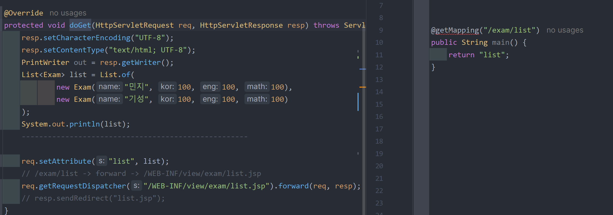

오버라이드 : 상속하는 클래스의 함수를 재정의하는 것
            파라미터, 반환형, 함수명까지 다 같고
            함수 바디만 다름

오버로드 : 생성자 정의하는 것
            함수명만 같고 파라미터, 반환형 다름

HttpServlet : 서블릿이가 요청을 받는 것
                컨트롤러 역할을 하는 클래스를 하사함

# servlet vs boot get 요청 비교

# servlet vs boot post 요청 비교

[   servlet으로  controller  구현하는 경우  ]
    -   .java 파일 한개로 한개의 컨트롤러만 구현가능
    -   자바 파일에는  public class가 단 하나만 존재 가능
    -   서블릿으로 상속받은 클래스가 컨트롤러 역할을 하므로
        퍼블릭 클래스인 컨트롤러가 단 하나만 존재가능
    -   여러개의 컨트롤러를 구현하려면 그만큼 .java파일 생성이 필요
    -   .java파일 한개에 하나의 url에 대한 get, post요청 처리 가능
    -   get. post 요청을 받는 서블릿이 제공하는 함수  doGet, doPost를 오버라이드하여 사용해야함
    

[   spring boot로 controller 구현하는 경우 ]
    -   하나의 .java 파일에 여러개의 url에 대한 get, post 요청 매핑이 가능
    -   클래스 상속을 받아서  get, post 관련 함수에 대한 오버라이드 불필요
